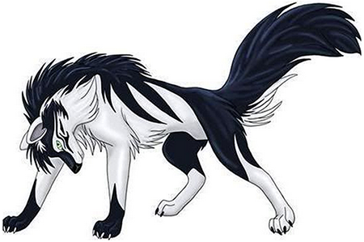

# iso-react-router-flux-pets

> Isomorphic react application using flux and react-router

## Running This

```sh
npm install; npm run build; npm start
```

Then open your browser to `localhost:8080` and enjoy.

There are a few routes you can visit directly:

`localhost:8080/pets` and `localhost:8080/pet`. 

Pets will display a list of the pets whereas pet will display all the info for a specific pet... e.g. /pet/darkdog

